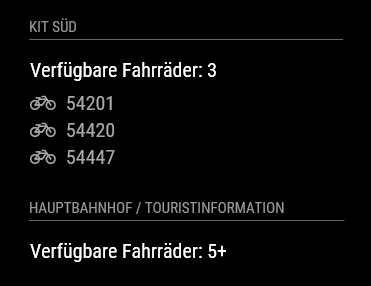
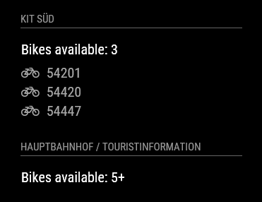

# MMM-nextbike
<B>Station monitor</B> for the <B>nextbike</B> bike-sharing network.

This module is an extension of the amazing [MagicMirror2](https://github.com/MichMich/MagicMirror) project by [MichMich](https://github.com/MichMich/) which has inspired me to share my coding skills with others as well. Check it out, you know you want to :). 

It's always nice to see mirrors using my work, so feel free to send me some screenshots of your implementations.

Lastly, why not join in on our discussions at the official [MagicMirror2 Forum](http://forum.magicmirror.builders/)?

## Screenshots

## Current version

v1.0.1

## Languages
As of version 1.0.0, MMM-nextbike features language support for `German (de)` and `English (en)` mirrors.

## Prerequisite
A working installation of [MagicMirror2](https://github.com/MichMich/MagicMirror)
 
## Dependencies
  * npm
  * [request](https://www.npmjs.com/package/request)
  * [xml2js](https://www.npmjs.com/package/xml2js)

## Installation
1. Navigate into your MagicMirror's `modules` folder.
2. Execute `git clone https://github.com/yo-less/MMM-nextbike.git`.
3. Execute `cd MMM-nextbike`.
3. Execute `npm install`.

## Module behavior
Please note that this module auto-creates a module header which displays the name of the chosen nextbike station.  
It is therefore recommended not to add a 'header' entry to your config.js for this module.

This module automatically disappears from your mirror as soon as a station has run out of bikes. It reappears shortly after the first bike has been returned to your chosen station.

This module has been programmed to allow for multiple instances. Simply add more MMM-nextbike config entries to your config.js file to display multiple stations and configure them according to your needs.

## Configuration
Sample minimum configuration entry for your `~/MagicMirror/config/config.js`:

    ...
    
    {
        module: 'MMM-nextbike',
        position: 'top_left',
        config: {
            cityID: '' ,  		// Your city ID
            stationID: '', 		// Your station ID
        }
    } 							// If this isn't your last module, add a comma after the bracket
    
    ...

Sample configuration entry for your `~/MagicMirror/config/config.js` with optional parameters:

    ...
    
    {
        module: 'MMM-nextbike',
        position: 'top_left',
        config: {
            cityID: '' ,  		// Your city ID
            stationID: '', 		// Your station ID
            showBikes: true, 	// Show available bike numbers (note: only up to 5 available bikes are shown)
            nob: 5, 			// How many available bikes should be listed at this station? (see note above)
            reload: 60000 		// How often should the information be updated? (In milliseconds)
        }
    } 							// If this isn't your last module, add a comma after the bracket
    
    ...

## Figuring out the correct cityID and stationID
1. Open your web browser and navigate to the [nextbike API result page](http://api.nextbike.net/maps/nextbike-official.xml).
2. Use STRG+F to find your station by name and note down its `place UID`, this is the `stationID` you need.
3. Next, go up some lines to the first `city UID` you can find, this is the `cityID` you need.

## Config Options
| **Option** | **Default** | **Description** |
| :---: | :---: | --- |
| cityID | 1 |  Which city do you want to use?  <EM> Default: Leipzig, Germany</EM>
 |
| stationID | 16337 |  Which station do you want to have displayed?  <EM> Default: Leipzig central station </EM>
 |
| showBikes | true |  Show available bike numbers (limited to a max of 5 by API)  <EM> Possible values: true, false </EM>
 |
| nob | 5 |  Up to how many bikes would you like to see?  <EM>Note: If there are more than 5 bikes available, the API simply returns the string "5+"</EM>
|
| reload | 60000 |  How often should the information be updated? (In milliseconds)  <EM> Default: every minute </EM>
 |

## Licence
MIT License

Copyright (c) 2016 yo-less / Jens

Permission is hereby granted, free of charge, to any person obtaining a copy
of this software and associated documentation files (the "Software"), to deal
in the Software without restriction, including without limitation the rights
to use, copy, modify, merge, publish, distribute, sublicense, and/or sell
copies of the Software, and to permit persons to whom the Software is
furnished to do so, subject to the following conditions:

The above copyright notice and this permission notice shall be included in all
copies or substantial portions of the Software.

THE SOFTWARE IS PROVIDED "AS IS", WITHOUT WARRANTY OF ANY KIND, EXPRESS OR
IMPLIED, INCLUDING BUT NOT LIMITED TO THE WARRANTIES OF MERCHANTABILITY,
FITNESS FOR A PARTICULAR PURPOSE AND NONINFRINGEMENT. IN NO EVENT SHALL THE
AUTHORS OR COPYRIGHT HOLDERS BE LIABLE FOR ANY CLAIM, DAMAGES OR OTHER
LIABILITY, WHETHER IN AN ACTION OF CONTRACT, TORT OR OTHERWISE, ARISING FROM,
OUT OF OR IN CONNECTION WITH THE SOFTWARE OR THE USE OR OTHER DEALINGS IN THE
SOFTWARE.
